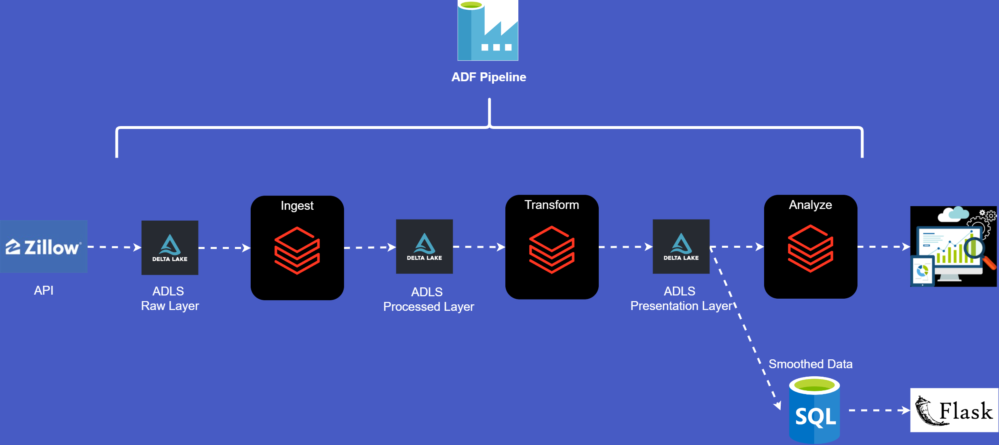
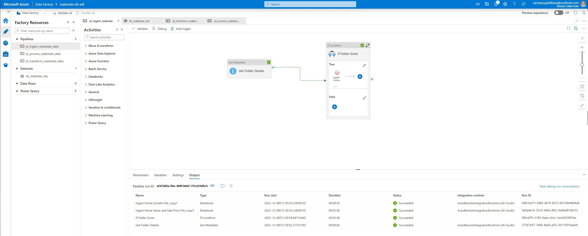
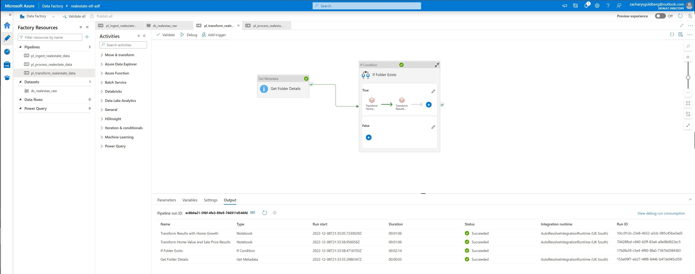
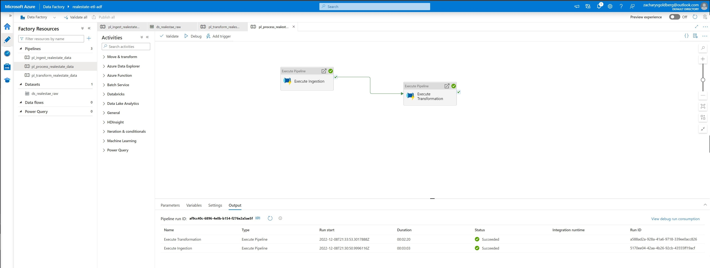

# Real Estate Data ETL

## Description

Ingested, transformed, and loaded data from Zillow's real estate API into an ETL pipeline using various Azure services including Azure Databricks and Azure Data Factory (ADF).
Created a pipeline by cleaning/ structuring raw historical and current market data for analyzing the potential return on real estate investment that each region would yield.

## Design

- Built a production level architecture for a Data Engineering solution using Azure Databricks, Azure Data Lake Gen2, and Azure Data Factory

- Created, configured, and monitored Databricks clusters, cluster pools, and jobs

- Mounted Azure Storage in Databricks using secrets stored in Azure Key Vault

- Created dashboards to visualise the outputs

- PySpark for Ingestion of CSV files into the data lake (ADLS) as delta files/ tables and Transformed for SQL analysis.

- Spark SQL for creating databases, tables, and transformations such as Filter, Join, Simple Aggregations, GroupBy, Window functions, etc.

- **Implemented Full Refresh and Incremental Load patterns using Partitions and ADLS Delta Lake**

- Used both PySpark as well as Spark SQL for Reading, Writing, Updating, Deleting and Merging data to Delta Lake

- Utilized History, Time Travel, and Vacuum

- Converted Parquet files to Delta files

- Created pipelines to execute Databricks notebooks

- Designed robust pipelines to deal with unexpected scenarios such as missing files

- Migrated Databricks CSV tables into Azure SQL database for user-facing queries

- Hosted simple Flask application for viewing data report and some exploratory analsyis through Azure SQL database

## ETL Flow Chart

## Data Factory Pipeline

### Ingestion

### Transformation

### Main Process

## Future Improvements

Scheduled data ingestion using ADF triggers
